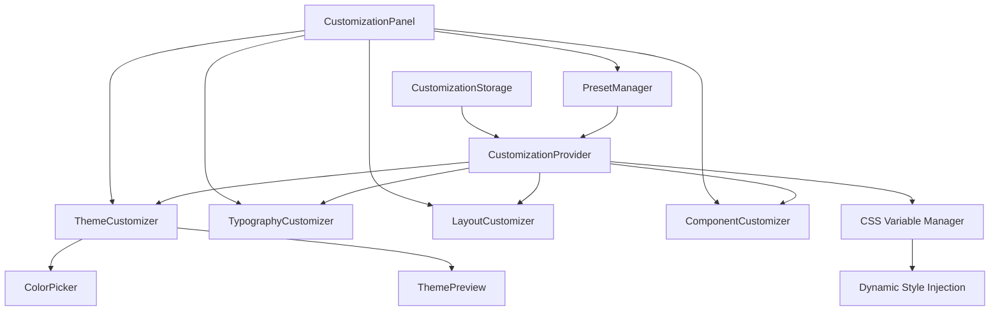

# Design Document

## Overview

The UI Customization System will transform the note-taking application into a highly customizable interface that maintains the current aesthetic while following Tailwind CSS and shadcn/ui best practices. The system will leverage CSS custom properties (CSS variables) for dynamic theming, implement a robust preset management system, and provide granular control over visual elements without compromising accessibility or performance.

The design builds upon the existing theme infrastructure (ThemeProvider, theme-plugin.js) and extends it to support user-defined customizations. The system will use a layered approach where base themes provide the foundation, and user customizations are applied as overrides using CSS custom properties.

## Architecture

### Core Components



### Data Flow

1. **Initialization**: CustomizationProvider loads saved customizations from storage
2. **User Interaction**: User modifies settings through CustomizationPanel
3. **State Management**: CustomizationProvider updates internal state
4. **CSS Generation**: CSS Variable Manager generates custom properties
5. **Style Application**: Dynamic styles are injected into document head
6. **Persistence**: Changes are saved to storage and can be exported as presets

### Storage Architecture

```typescript
interface CustomizationState {
  theme: {
    colors: {
      primary: string;
      secondary: string;
      accent: string;
      background: string;
      foreground: string;
      card: string;
      border: string;
      muted: string;
      destructive: string;
    };
    mode: 'light' | 'dark' | 'dim';
  };
  typography: {
    fontFamily: string;
    fontSize: {
      base: number;
      scale: number;
    };
    lineHeight: number;
    fontWeight: {
      normal: number;
      medium: number;
      semibold: number;
    };
  };
  layout: {
    density: 'compact' | 'comfortable' | 'spacious';
    borderRadius: number;
    spacing: {
      scale: number;
    };
  };
  components: {
    buttons: ComponentCustomization;
    cards: ComponentCustomization;
    inputs: ComponentCustomization;
  };
}
```

## Components and Interfaces

### 1. CustomizationProvider

**Purpose**: Central state management for all customization settings

**Key Features**:
- Manages global customization state
- Provides context to child components
- Handles persistence and loading
- Generates CSS custom properties
- Validates customizations for accessibility

**Interface**:
```typescript
interface CustomizationContextType {
  customizations: CustomizationState;
  updateTheme: (theme: Partial<ThemeCustomization>) => void;
  updateTypography: (typography: Partial<TypographyCustomization>) => void;
  updateLayout: (layout: Partial<LayoutCustomization>) => void;
  updateComponent: (component: string, customization: ComponentCustomization) => void;
  resetToDefaults: () => void;
  applyPreset: (preset: CustomizationPreset) => void;
  exportPreset: () => CustomizationPreset;
}
```

### 2. CustomizationPanel

**Purpose**: Main UI for accessing all customization options

**Key Features**:
- Tabbed interface for different customization categories
- Live preview of changes
- Reset and preset management controls
- Responsive design for different screen sizes

**Structure**:
- Theme tab (colors, mode switching)
- Typography tab (fonts, sizes, weights)
- Layout tab (density, spacing, borders)
- Components tab (individual component styling)
- Presets tab (save, load, share presets)

### 3. ThemeCustomizer

**Purpose**: Color and theme customization interface

**Key Features**:
- Color picker for primary, secondary, accent colors
- Automatic contrast ratio validation
- Light/dark mode toggle with custom colors
- Real-time preview of color changes
- Accessibility warnings for poor contrast

**Implementation Details**:
- Uses HSL color space for better manipulation
- Generates complementary colors automatically
- Maintains WCAG AA contrast standards
- Integrates with existing theme system

### 4. TypographyCustomizer

**Purpose**: Font and text styling controls

**Key Features**:
- Font family selection (system fonts + web fonts)
- Font size scaling with proper hierarchy
- Line height adjustment
- Font weight customization
- Preview text samples

**Font Options**:
- System fonts (Inter, SF Pro, Segoe UI, etc.)
- Popular web fonts (Roboto, Open Sans, Lato, etc.)
- Monospace fonts for code (Fira Code, JetBrains Mono, etc.)

### 5. LayoutCustomizer

**Purpose**: Spacing, density, and layout controls

**Key Features**:
- Density presets (compact, comfortable, spacious)
- Custom spacing scale adjustment
- Border radius customization
- Grid and layout density controls

**Density Mappings**:
- Compact: 0.8x spacing, smaller padding, tighter line height
- Comfortable: 1.0x spacing (default)
- Spacious: 1.2x spacing, larger padding, relaxed line height

### 6. ComponentCustomizer

**Purpose**: Individual component styling

**Key Features**:
- Visual component selector
- Style overrides for specific components
- Variant-specific customizations
- Component-level reset options

**Supported Components**:
- Buttons (all variants)
- Cards (note cards, UI cards)
- Input fields
- Navigation elements
- Modals and dialogs

### 7. PresetManager

**Purpose**: Save, load, and share customization presets

**Key Features**:
- Named preset creation
- Preset thumbnails/previews
- Import/export functionality
- Preset validation and migration
- Community preset sharing (future)

**Preset Format**:
```typescript
interface CustomizationPreset {
  id: string;
  name: string;
  description?: string;
  author?: string;
  version: string;
  createdAt: Date;
  customizations: CustomizationState;
  preview: {
    colors: string[];
    thumbnail?: string;
  };
}
```

## Data Models

### Color System

The system will use HSL color space for better manipulation and automatic variant generation:

```typescript
interface ColorDefinition {
  hue: number;
  saturation: number;
  lightness: number;
  alpha?: number;
}

interface ThemeColors {
  primary: ColorDefinition;
  secondary: ColorDefinition;
  accent: ColorDefinition;
  background: ColorDefinition;
  foreground: ColorDefinition;
  card: ColorDefinition;
  border: ColorDefinition;
  muted: ColorDefinition;
  destructive: ColorDefinition;
}
```

### Typography System

```typescript
interface TypographyScale {
  xs: number;
  sm: number;
  base: number;
  lg: number;
  xl: number;
  '2xl': number;
  '3xl': number;
  '4xl': number;
}

interface TypographyCustomization {
  fontFamily: {
    sans: string[];
    mono: string[];
  };
  fontSize: TypographyScale;
  lineHeight: {
    tight: number;
    normal: number;
    relaxed: number;
  };
  fontWeight: {
    normal: number;
    medium: number;
    semibold: number;
    bold: number;
  };
}
```

### Component Customization

```typescript
interface ComponentCustomization {
  colors?: Partial<ThemeColors>;
  spacing?: {
    padding: string;
    margin: string;
  };
  borders?: {
    width: string;
    radius: string;
    style: string;
  };
  typography?: {
    fontSize: string;
    fontWeight: string;
    lineHeight: string;
  };
  effects?: {
    shadow: string;
    transition: string;
  };
}
```

## Error Handling

### Validation System

1. **Color Validation**:
   - Contrast ratio checking (WCAG AA/AAA compliance)
   - Color format validation
   - Accessibility warnings for problematic combinations

2. **Typography Validation**:
   - Font availability checking
   - Size ratio validation
   - Readability assessments

3. **Layout Validation**:
   - Minimum/maximum spacing constraints
   - Responsive breakpoint compatibility
   - Component overlap prevention

### Error Recovery

1. **Graceful Degradation**: Invalid customizations fall back to defaults
2. **Validation Warnings**: Non-blocking warnings for accessibility issues
3. **Automatic Correction**: Suggest alternative values for invalid inputs
4. **Backup System**: Automatic backup of working configurations

## Testing Strategy

### Unit Testing

1. **Component Tests**:
   - CustomizationProvider state management
   - Color manipulation utilities
   - CSS variable generation
   - Preset import/export functionality

2. **Integration Tests**:
   - Theme application across components
   - Persistence and loading
   - Cross-component consistency
   - Accessibility compliance

### Visual Testing

1. **Snapshot Testing**: Component appearance with different customizations
2. **Cross-browser Testing**: Ensure consistent rendering
3. **Responsive Testing**: Customizations work across screen sizes
4. **Accessibility Testing**: Color contrast, keyboard navigation

### Performance Testing

1. **CSS Generation Performance**: Large customization sets
2. **Memory Usage**: Multiple preset loading
3. **Render Performance**: Dynamic style updates
4. **Storage Performance**: Large preset collections

### User Testing

1. **Usability Testing**: Customization workflow
2. **Accessibility Testing**: Screen reader compatibility
3. **Performance Testing**: Real-world usage patterns
4. **Cross-platform Testing**: Different operating systems

## Implementation Phases

### Phase 1: Foundation
- Extend existing theme system
- Implement CustomizationProvider
- Basic color customization
- CSS variable management

### Phase 2: Core Features
- Typography customization
- Layout density controls
- Component customization
- Basic preset system

### Phase 3: Advanced Features
- Advanced color tools
- Component-specific styling
- Preset sharing
- Import/export functionality

### Phase 4: Polish
- Performance optimization
- Advanced accessibility features
- User experience refinements
- Documentation and help system

## Technical Considerations

### CSS Custom Properties Strategy

The system will generate CSS custom properties dynamically:

```css
:root {
  /* Base theme variables (existing) */
  --primary: 39 100% 50%;
  
  /* User customization overrides */
  --user-primary: var(--primary);
  --user-primary-h: 39;
  --user-primary-s: 100%;
  --user-primary-l: 50%;
  
  /* Component-specific overrides */
  --button-primary: var(--user-primary);
  --card-background: var(--user-card);
}
```

### Performance Optimization

1. **Lazy Loading**: Load customization UI only when needed
2. **Debounced Updates**: Batch CSS updates to prevent excessive reflows
3. **Memoization**: Cache generated CSS strings
4. **Selective Updates**: Only update changed properties

### Accessibility Compliance

1. **WCAG Guidelines**: Enforce AA contrast ratios minimum
2. **Color Blindness**: Provide alternative visual cues
3. **High Contrast Mode**: Respect system preferences
4. **Keyboard Navigation**: Full keyboard accessibility
5. **Screen Reader Support**: Proper ARIA labels and descriptions

### Browser Compatibility

- Modern browsers with CSS custom property support
- Graceful degradation for older browsers
- Polyfills where necessary
- Progressive enhancement approach